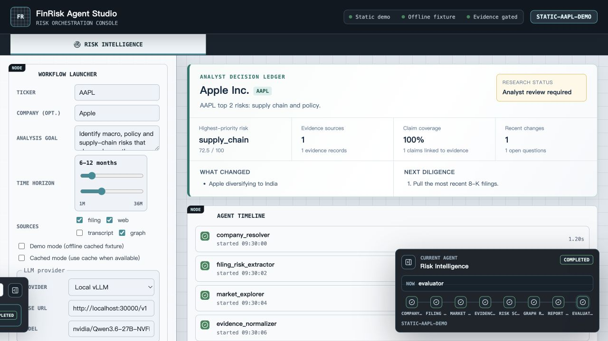
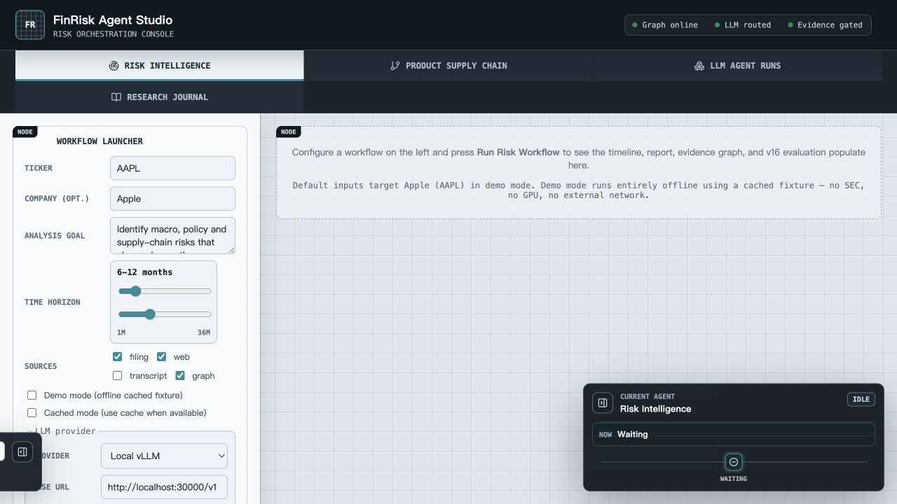
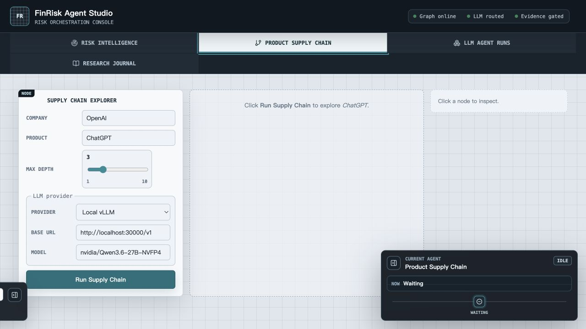
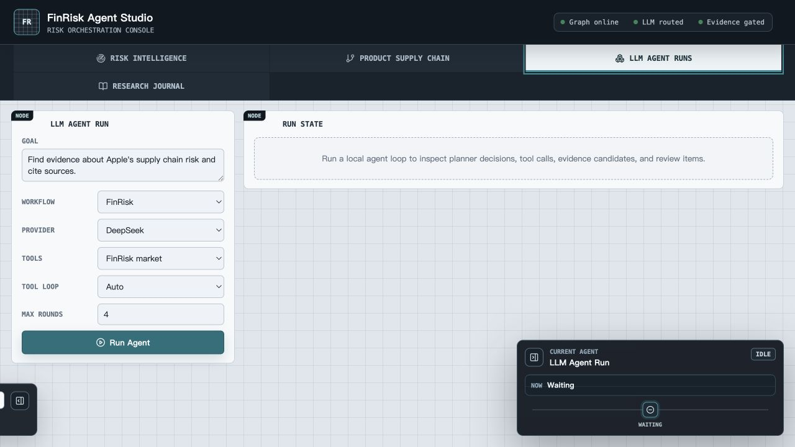
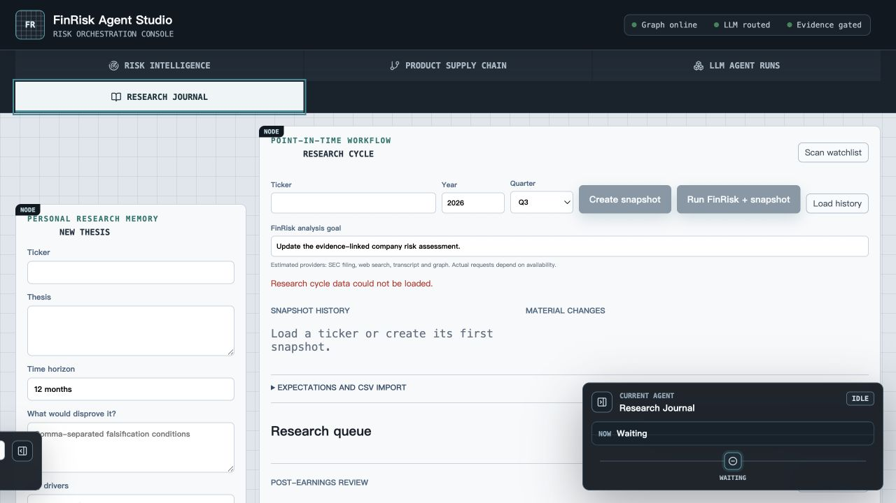
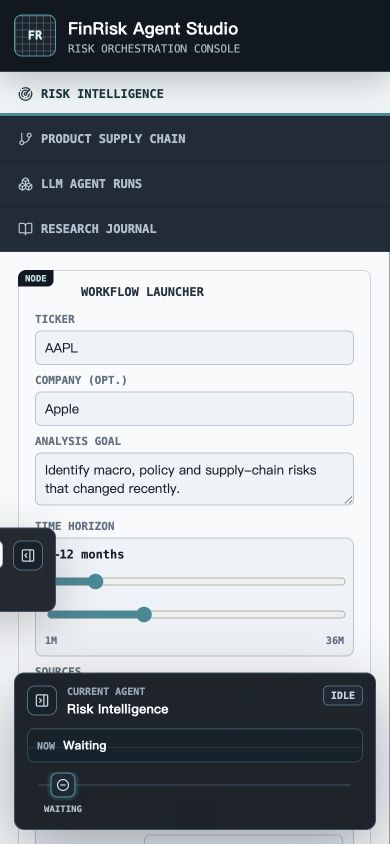

# FinRisk Agent Studio 产品 / UI / UX 审计报告

审计日期：2026-07-12  
审计范围：React 前端的 Risk Intelligence、Product Supply Chain、LLM Agent Runs、Research Journal，以及静态演示和 390px 移动端状态。  
审计方法：本地构建、真实浏览器逐页截图、DOM/语义结构检查、响应式检查、关键组件与样式源码核对。  

## 1. 结论摘要

FinRisk Agent Studio 已经有一个很清晰、也很稀缺的产品内核：**证据优先、过程可追踪、结果需复核**。问题不在功能不足，而在于前端仍按“后端能力清单”组织，而不是按分析师的决策任务组织。

当前最需要处理的不是视觉润色，而是四个结构性问题：

1. **系统状态会失真。** 后端不可用时，页头仍显示 `Graph online / LLM routed / Evidence gated`，这对金融研究产品的可信度伤害最大。
2. **首屏没有建立单一主任务。** 运行参数、模型参数、执行历史、Agent 监视器和结果区同时争夺注意力。
3. **结果页缺少“结论 → 证据 → 质量 → 过程”的顺序。** 当前时间线和两个 Evaluation 区块占据了大量纵向空间，核心决策信息被拆散。
4. **响应式只是重排，没有解决遮挡。** 390px 下固定浮层直接盖住表单和 CTA；1280px 下四个主导航被三列网格强制换行。

建议把当前版本定义为：**能力完整度较高，产品化成熟度中等，核心工作流可用，但信息架构、信任状态和移动端尚未达到正式分析工作台的标准。**

## 2. 审计步骤与界面健康度

### Step 1 — 静态 Risk Intelligence 成果页：一般

优点：决策摘要、最高风险、证据数量、Claim coverage 和下一步研究问题能够形成初步的分析师摘要；“证据”和“人工复核”是明确的产品差异点。

问题：静态演示只暴露 Risk Intelligence，掩盖了完整产品的另外三类能力；首屏左侧仍展示模型与运行配置，结果阅读和重新运行混在同一个视觉层级；右下角 Agent 监视器遮住结果区。

### Step 2 — 完整模式 Risk Intelligence 空状态：较差

问题：空状态面积很大，但只说明“运行后会看到什么”，没有示例结果、预计耗时、数据来源、运行成本或失败前置条件；主 CTA 位于长表单底部，1280×720 首屏不可见。页头在 API 实际不可达时仍显示在线状态，形成严重信任缺口。

### Step 3 — Product Supply Chain 空状态：一般偏差

优点：表单短，Company / Product / depth 的任务模型相对清楚。

问题：中间画布和右侧 Drawer 同时为空，造成大面积无信息空间；没有告诉用户图会回答什么问题、节点/边代表什么、深度 3 的成本与影响是什么；模型配置再次暴露在主流程中。右下角监视器持续遮住画布。

### Step 4 — LLM Agent Runs 空状态：一般偏差

优点：Goal 是自然语言入口，符合 Agent 产品心智。

问题：Workflow、Provider、Tools、Tool loop、Max rounds 五组技术参数平铺，用户必须理解运行时实现才能开始；Workflow 与 Tools 可以独立组合，界面没有解释兼容关系；默认 Provider 与其他工作流不一致；空状态使用 planner / tool calls / evidence candidates / review items 等内部术语，没有先说明用户最终能获得什么。

### Step 5 — Research Journal 首屏：较差

优点：Thesis、反证条件、Watchlist、快照、重大变化、财报后复盘这些对象组合起来，确实构成了个人研究闭环。

问题：New Thesis、Research Cycle、Snapshot、Watchlist scan、Material Changes、Expectations、Research Queue、Post-earnings Review、Peer Analysis 同屏竞争，缺少明确的日常入口；错误只显示“could not be loaded”，没有重试、连接状态或保留可用区域的说明；多个按钮因缺少 ticker 等条件被禁用，但没有就地解释解锁条件。

### Step 6 — 390px 移动端 Risk Intelligence：不可用

问题：四个主导航纵向占用 180px；展开的 Agent monitor 固定在底部，覆盖表单，折叠后的 Run History 仍在左侧占用可见区域；CTA 位于首屏之外。移动端虽无水平溢出，但核心任务路径被浮层中断。

## 3. 最高优先级问题

### P0-1：运行状态不是实时健康状态，直接损害可信度

页头状态文案由静态条件直接渲染，并不读取真实健康检查：[App.tsx](../../../frontend/src/App.tsx#L527-L530)。本次审计中 API 连接失败，但界面仍显示 `Graph online`、`LLM routed`、`Evidence gated`。

对金融研究工具而言，这不是普通文案问题，而是“用户是否可以相信结果”的基础契约。建议：

- 将状态拆成 `API / Graph / LLM / Data providers`，每项由真实 health endpoint 驱动。
- 未检查时使用 `Unknown` 或 `Not checked`，不要默认绿色。
- 点击状态可打开诊断详情；运行前阻止明显不可能成功的配置。
- 静态演示明确标识“Fixture result”，不要与在线能力共用同一种绿色状态语言。

### P0-2：固定浮层遮挡主任务，移动端不可用

Agent monitor 和 Run History 都使用 fixed 定位：[styles.css](../../../frontend/src/styles.css#L2217-L2230)、[styles.css](../../../frontend/src/styles.css#L2512-L2528)。在 390×844 下，Agent monitor 占据约 `362×158px`，覆盖底部表单；移动端样式仍让它保持展开：[styles.css](../../../frontend/src/styles.css#L2695-L2707)、[styles.css](../../../frontend/src/styles.css#L2741-L2749)。

建议：

- 小于 920px 时默认折叠；小于 620px 时改为底部 Sheet，由用户主动打开。
- 运行中只保留一行状态条，完成后自动收起。
- 为页面正文预留安全区，或让浮层进入正常文档流。
- History 和 Monitor 不应同时以 fixed 面板存在；合并为一个“Activity”入口。

### P1-1：产品信息架构按技术子系统平铺，不按用户任务组织

四个一级入口分别是 `Risk Intelligence / Product Supply Chain / LLM Agent Runs / Research Journal`：[App.tsx](../../../frontend/src/App.tsx#L539-L579)。它们混合了用户目标、分析方法、运行时和持久化对象：

- Risk Intelligence、Supply Chain 是研究任务。
- LLM Agent Runs 是执行方式 / 调试面板。
- Research Journal 是跨任务的长期工作区。

建议的一级结构：

1. **Today / Research Queue**：提醒、重大变化、待复核结果。
2. **Company Workspace**：公司概览、Risk、Financials、Valuation、Management、Supply Chain。
3. **Research Runs**：运行历史、Agent trace、人工复核；高级用户入口。
4. **Journal**：Thesis、Expectations、Watchlist、Post-earnings review。

这样 Supply Chain 不再是孤立产品，而是公司研究的一种分析视角；Agent Runs 也不再与用户目标争夺一级导航。

### P1-2：主流程过早暴露模型和运行时细节

Risk 与 Supply Chain 都在主表单展示 Provider、Base URL、Model；Agent Run 还暴露 Tool loop 与 Max rounds。相关入口见 [WorkflowLauncher.tsx](../../../frontend/src/components/WorkflowLauncher.tsx#L206-L218)、[LLMAgentRunPanel.tsx](../../../frontend/src/components/LLMAgentRunPanel.tsx#L419-L503)。

这些字段更适合“Advanced settings / Runtime profile”。默认流程只需要：

- 研究对象；
- 用户想回答的问题；
- 时间范围；
- 数据范围或预设模式。

建议提供 `Fast / Balanced / Deep` 三个运行预设，并在展开的 Advanced 区域显示 Provider、Model、工具预算、缓存策略。产品语言表达结果与成本，技术语言留给需要控制的人。

### P1-3：Risk 结果页重复且顺序倒置

完成态依次渲染 Decision Brief、Timeline、Financials、Valuation、Management、EvaluationPanel、EvaluationTab、Risk Report、Score、Claim Matrix、Graph：[App.tsx](../../../frontend/src/App.tsx#L653-L711)。这导致：

- 两个区块都叫 `Evaluation`，数据口径却不同：[EvaluationPanel.tsx](../../../frontend/src/components/EvaluationPanel.tsx#L24-L73)、[EvaluationTab.tsx](../../../frontend/src/components/EvaluationTab.tsx#L98-L146)。
- 静态演示已经有 72.5 的最高风险，但 Score 组件仍显示 `No risk scores yet`，用户会认为数据矛盾：[RiskScoreBreakdown.tsx](../../../frontend/src/components/RiskScoreBreakdown.tsx#L16-L22)。
- Pipeline timeline 在核心报告之前，强调“系统做了什么”多于“分析师现在应做什么”。

建议按以下顺序重组：

1. Decision Brief：结论、变化、风险、下一步。
2. Evidence & confidence：关键证据、反证、覆盖率、质量门禁。
3. Analysis：风险详情、财务影响、估值与图关系。
4. Activity / Technical trace：Timeline、step evaluation、LLM/tool trace，默认折叠。

两个 Evaluation 合并成一个 Quality & Review 区，统一指标口径和解释。

### P1-4：四个主导航被三列 CSS 网格强制换行

主导航写死为三列：[styles.css](../../../frontend/src/styles.css#L1674-L1683)，但完整模式有四个入口。1280px 截图中 Research Journal 被挤到第二行，产生类似“次级功能”的错误层级，也让 header 高度在模式之间变化。

建议根据最终 IA 改为四列、横向滚动或左侧导航；如果保留四个一级入口，桌面端必须保持同一行并有 `aria-current` / `aria-selected` 状态。

### P1-5：Research Journal 是多个工作流的集合，而不是可扫描的工作台

Research Cycle 自身同时包含 Snapshot、Material Changes、Expectations、Alerts、Queue、Post-earnings、Peer Analysis：[ResearchCyclePanel.tsx](../../../frontend/src/components/ResearchCyclePanel.tsx#L273-L320)。这让用户无法判断“今天最重要的动作”。

建议：

- Journal 首页先展示 `Due today / New evidence / Needs review / Upcoming earnings`。
- New Thesis 使用单独 Sheet 或页面，不长期占据左侧 330px。
- 选择 ticker 后再逐步展开 Snapshot、Peer、Expectations。
- Post-earnings 仅在存在两个快照和关联 Thesis 时出现，不要长期显示一个不可用按钮。

## 4. UI 与视觉设计问题

### 4.1 视觉语言过度强调“节点 / 控制台”，削弱金融研究的可读性

网格背景、每个卡片的 `node` 标签、全大写等宽标题、深色浮动监视器共同形成强烈的工程控制台风格。伪元素甚至为每个 section 自动写入 `node`：[styles.css](../../../frontend/src/styles.css#L1764-L1779)。

这对“Agent Studio”有辨识度，但使用过量后会：

- 让所有卡片看起来同等重要；
- 增加背景噪声，削弱表格和证据文本；
- 把分析师工作台做成调试器，而不是决策工具。

建议保留深色顶栏和少量图谱语言，把 `node` 标签仅用于真正的工作流节点或图实体；主要阅读区改为更安静的白/浅灰背景，扩大正文行高和段落间距。

### 4.2 字号与全大写使用过密

大量标签、状态和节点名称使用 9–12px 等宽全大写。它有技术感，但在高密度页面上扫描成本很高，尤其是非英语母语用户和高分屏缩放用户。

建议：正文最低 14px，辅助信息 12px，避免 9–10px 承载关键状态；区块标题使用正常大小写，等宽字体只用于 run ID、ticker、数值和代码。

### 4.3 禁用态可见性不足

禁用主按钮使用 `#8798a7` 背景配 `#f7fbfd` 文本，计算对比度约 2.85:1。禁用控件在 WCAG 中有豁免，但产品上仍难以区分“可点击”“系统忙”“缺少输入”三种状态。

建议不仅改变颜色，还增加就地条件说明，例如 `Enter ticker to create snapshot`，并使用 tooltip / helper text 解释禁用原因。

### 4.4 表单缺少分组与渐进披露

Risk Launcher 把目标、时间、来源、缓存、Demo、LLM 设置放在同一个连续表单中。建议分成：

- `Research question`（对象、目标、时间）；
- `Evidence scope`（来源、缓存）；
- `Runtime`（Advanced，默认折叠）。

### 4.5 空状态和错误状态没有承担引导作用

当前空状态多为一句说明，Research Journal 错误仅是 `could not be loaded`。建议所有状态都包含：

- 发生了什么；
- 用户仍然可以做什么；
- 下一步动作；
- 若是系统问题，提供重试和诊断入口。

Supply Chain 可提供 2–3 个样例：`Apple → iPhone`、`NVIDIA → H100`、`OpenAI → ChatGPT`，并预览预期图形。

## 5. UX 与交互问题

### 5.1 运行前缺少成本、时间和依赖预期

用户在点击 Run 前不知道预计耗时、会调用哪些外部数据、是否需要在线模型、缓存命中与否、最大浏览步骤意味着什么。建议在 CTA 上方显示一行运行摘要：

`Deep research · ~3–6 min · SEC + web + graph · cached where available`

### 5.2 默认配置不一致

Risk / Supply Chain 默认本地 vLLM，Agent Run 默认 DeepSeek；Provider 命名也在不同组件中出现 `Local vLLM`、`vLLM`、`Local LLM` 等视觉结果。建议统一为可复用的 Runtime Profile，并让所有工作流继承当前 profile。

### 5.3 选择项可能形成无意义组合

Agent Run 的 Workflow 与 Tools 是独立下拉框，没有显示映射关系或约束：[LLMAgentRunPanel.tsx](../../../frontend/src/components/LLMAgentRunPanel.tsx#L419-L470)。建议 Workflow 选择后自动推荐 Tool scope；只有高级模式允许覆写，并在不兼容时阻止运行。

### 5.4 状态监视器默认过强

Agent monitor 在 idle 时仍以 430px 宽深色浮层出现。它应该在运行时帮助用户，而不是永久占据注意力。idle 时只保留一个小 Activity 状态，运行开始后展开，结束后收起并显示结果入口。

### 5.5 静态演示没有展示完整产品价值

静态模式通过条件直接隐藏 Supply Chain、Agent Runs、Journal：[App.tsx](../../../frontend/src/App.tsx#L549-L579)。公开 Demo 因而更像单页 Risk Dashboard，而不是 Agent Studio。

建议保留完整导航，并为每个页面提供只读 fixture；如果暂时做不到，应在静态页加入明确的“Full product includes”能力地图，而不是直接隐藏。

## 6. 可访问性风险

以下是结合截图和源码确认或高度可疑的问题，不代表完整 WCAG 合规测试。

### 已有的良好基础

- 大多数输入有显式 label 或 aria-label。
- 全局存在 `:focus-visible` 样式：[styles.css](../../../frontend/src/styles.css#L1569-L1577)。
- 存在 `prefers-reduced-motion` 处理：[styles.css](../../../frontend/src/styles.css#L2773-L2779)。
- 移动端主导航按钮高度为 44px，满足常见触控目标建议。
- Monitor 节点可聚焦，tooltip 同时支持 hover 和 focus。

### 主要风险

1. **导航状态主要依赖视觉 active 样式。** 当前是 nav 内普通 button，没有 tablist / tab / aria-selected，也没有 aria-current。屏幕阅读器不容易知道当前视图。
2. **运行状态没有 live region。** Agent progress、错误、完成状态都没有 `aria-live` 或 `role=status`；视觉更新不一定被辅助技术宣布。
3. **错误没有 alert 语义。** `.error-banner` 与 journal error 只是 div / p，没有 `role=alert`，异步失败可能被错过。
4. **页面可能出现多个 H1。** 顶栏产品名是 H1，Risk Report 内再次使用 H1：[RiskReport.tsx](../../../frontend/src/components/RiskReport.tsx#L27-L32)，会让文档层级含混。
5. **浮层遮挡与焦点顺序风险。** Fixed monitor 不是 modal，却覆盖内容；键盘用户仍可 Tab 到被遮挡区域。
6. **高密度表格的窄屏策略不一致。** 部分表格有 `.table-scroll`，RiskScoreBreakdown 的表格直接内联渲染，无响应式容器；需在真实完成态继续验证 200% zoom 与 320px reflow。
7. **禁用控件缺少原因。** 辅助技术只能知道 disabled，无法知道缺少 ticker、快照或 thesis 中的哪一个条件。

建议把目标定为 WCAG 2.2 AA，并补充键盘全流程、屏幕阅读器状态播报、200%/400% zoom、颜色对比和表格重排测试。

## 7. 产品机会

### 7.1 把“Evidence-first”做成统一交互模型

现在证据、Claim、Graph、Evaluation 分散在多个区块。可以建立统一的三层模型：

- **Claim**：系统得出的结论；
- **Evidence**：支持或反驳它的来源；
- **Review state**：已通过、需复核、已驳回。

任何风险、变化、估值假设、同行选择都可以复用这三层，并支持点击追溯。这样产品差异不只是一组区块，而是贯穿所有功能的工作方式。

### 7.2 建立“分析师首页”

当前用户每次进入都从一个运行器开始。更成熟的工作台应该优先回答：

- 哪些公司发生了重大变化？
- 哪些结果需要我复核？
- 哪些 Thesis 接近失效条件？
- 哪些运行失败或证据不足？
- 下一场财报前我还缺什么？

运行器成为处理任务的手段，不再是产品首页本身。

### 7.3 将高级可观测性保留，但降低默认权重

Timeline、tool trace、fallback、step evaluation 都很有价值，尤其适合开源参考实现和高级研究者。建议保留完整能力，但默认收进 `Technical trace`，让普通用户先看到决策结果，高级用户再展开审计细节。

## 8. 推荐整改路线图

### 第一阶段：信任与可用性（1–3 天）

- 用真实 health 状态替换页头静态绿色状态。
- 修复四入口 / 三列导航问题。
- 移动端默认折叠 Activity 面板，消除遮挡。
- 合并两个 Evaluation 标题或至少改成 `Result quality` / `Step guardrails`。
- 所有错误增加 Retry，关键异步状态增加 aria-live。

### 第二阶段：主工作流重构（1–2 周）

- Risk 表单做渐进披露，把 Runtime 放进 Advanced。
- 结果页按 Decision → Evidence → Analysis → Trace 重排。
- Research Journal 改成 Queue-first 首页，新建 Thesis 使用独立流程。
- Agent Run 用预设约束 Workflow / Tools / Provider 组合。
- 四个静态 fixture 页面补齐公开 Demo。

### 第三阶段：视觉与无障碍（1 周）

- 减少网格、`node` 标签和全大写等宽文本。
- 建立 14/16px 正文字号和统一的标题层级。
- 固化状态色、风险色、证据质量色的语义，不只靠颜色表达。
- 完成 320px、390px、768px、1280px、1440px 和 200% zoom QA。
- 完成键盘、屏幕阅读器和 WCAG 2.2 AA 检查。

## 9. 验证范围与限制

- 已验证 production build 成功。
- 已通过真实浏览器检查四个主视图、静态完成态和 390px 移动端。
- 当前项目虚拟环境的 uvicorn shebang 仍指向旧目录，因此本次无法运行完整 FastAPI 后端；完整模式截图中的后端失败状态是有意保留的审计证据，也因此未执行会创建真实运行记录的操作。
- 未完成真实长任务的 loading、partial success、retry、review action、图交互、200%/400% zoom 和屏幕阅读器测试。
- 可访问性结论仅描述已观察到的风险，不能视为完整合规认证。

## 10. 最终优先级清单

| 优先级 | 问题 | 用户影响 | 建议负责人 |
|---|---|---|---|
| P0 | 在线状态失真 | 错误信任系统与结果 | Product + Frontend + API |
| P0 | 移动端浮层遮挡 | 核心任务无法完成 | Frontend |
| P1 | 一级 IA 混合任务与运行时 | 找不到正确入口 | Product Design |
| P1 | 结果页重复 Evaluation、顺序倒置 | 难以形成决策 | Product + Frontend |
| P1 | 主表单暴露过多模型参数 | 首次运行门槛高 | Product + Frontend |
| P1 | Research Journal 功能竞争 | 日常研究动作不清晰 | Product Design |
| P1 | 四入口 / 三列导航 | 层级错误、布局跳动 | Frontend |
| P2 | 空状态与错误状态缺引导 | 用户无法恢复 | UX Writing + Frontend |
| P2 | 静态 Demo 不完整 | 公开价值表达不足 | Product |
| P2 | 状态播报和导航语义不足 | 辅助技术体验不完整 | Frontend + QA |
| P2 | 控制台视觉语言过量 | 阅读疲劳、专业感偏工程化 | UI Design |
